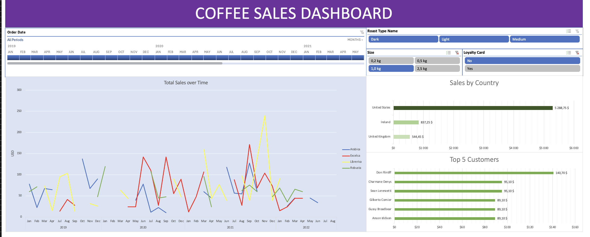

# ☕ Coffee Sales Interactive Dashboard

> **A comprehensive sales dashboard built in Excel to analyze coffee shop performance, customer behavior, and product trends.**

---

## 📊 Final Dashboard

  

---

## 🎯 Project Overview

This project showcases the end-to-end process of building a dynamic and interactive sales dashboard in Microsoft Excel. The primary goal was to transform raw sales data into actionable insights, allowing stakeholders to easily analyze performance across different dimensions like time, product, and customer demographics.

The final dashboard integrates multiple charts, slicers, and a timeline, providing a centralized and user-friendly tool for business intelligence.

---

## 🚀 Key Features & Visualizations

The dashboard is composed of several key analytical components:

- **Total Sales Over Time:** A line chart tracking sales performance across different coffee types, allowing for trend analysis over monthly and yearly periods.
- **Sales by Country:** A bar chart highlighting the top-performing countries by sales volume.
- **Top 5 Customers:** A focused bar chart identifying the most valuable customers, enabling targeted marketing and loyalty programs.
- **Interactive Controls:**
  - **Timeline:** Allows for intuitive date-range filtering across the entire dashboard.
  - **Slicers:** Provide granular filtering for `Roast Type`, `Size`, and `Loyalty Card` status, enabling deep-dive analysis.

  
  
  
  

---

## 🛠️ Methodology & Technical Skills

The dashboard was built following a structured, multi-step process, demonstrating a wide range of Excel capabilities.

### 1. Data Consolidation & Enrichment
- **Data Gathering:** Used `XLOOKUP` and `INDEX MATCH` to merge data from `Orders`, `Customers`, and `Products` tables into a single, unified dataset.
  - `Customer Name: =XLOOKUP(C2;customers!$A$1:$A$1001;customers!$B$1:$B$1001;;0)`
  - `Product Details: =INDEX(products!$A$1:$G$49;MATCH(orders!$D2;products!$A$1:$A$49;0);MATCH(orders!I$1;products!$A$1:$G$1;0))`
- **Data Transformation:** Employed `IF` statements to expand abbreviations into full names (e.g., "M" to "Medium").
  - `=IF(J2="M";"Medium"; IF(J2="L"; "Light"; IF(J2="D";"Dark";"")))`
- **Data Cleaning:** Removed duplicate entries and converted the final dataset into a formal Excel Table (`Cmd + T`) for structured referencing.

### 2. PivotTables & Charting
- **PivotTables:** Created multiple PivotTables to aggregate and summarize data for each visualization (Total Sales, Sales by Country, Top 5 Customers).
- **PivotCharts:** Built corresponding PivotCharts from the aggregated data.
- **Formatting:** Applied custom formatting, including currency symbols (`€`), date formats (`dd-mmm-yyyy`), and consistent color schemes to enhance readability and visual appeal.

### 3. Dashboard Assembly & Interactivity
- **Dashboard Layout:** Assembled all charts and controls onto a single "Dashboard" sheet.
- **Slicers & Timelines:** Inserted slicers and a timeline for intuitive, user-driven filtering.
- **Report Connections:** Connected all slicers and the timeline to every PivotTable on the dashboard, ensuring that all visualizations update in unison based on user selections.

---

## 🗂️ Data Model

The analysis is based on three core tables:

- **📦 Orders Table:** Contains transactional data like `Order ID`, `Order Date`, `Customer ID`, `Product ID`, and `Quantity`.
- **🧑‍🤝‍🧑 Customers Table:** Holds customer demographic information, including `Customer Name`, `Email`, `Country`, and `Loyalty Card` status.
- **☕ Products Table:** Includes product details such as `Coffee Type`, `Roast Type`, `Size`, `Unit Price`, and `Profit`.

---

## 📬 Contact

**Ivan Zamurenko**  

---

  <i>Built with 📊 data-driven insights and ☕ attention to detail</i>

  © 2025 Ivan Zamurenko | Coffee Shop Sales Analytics Project

