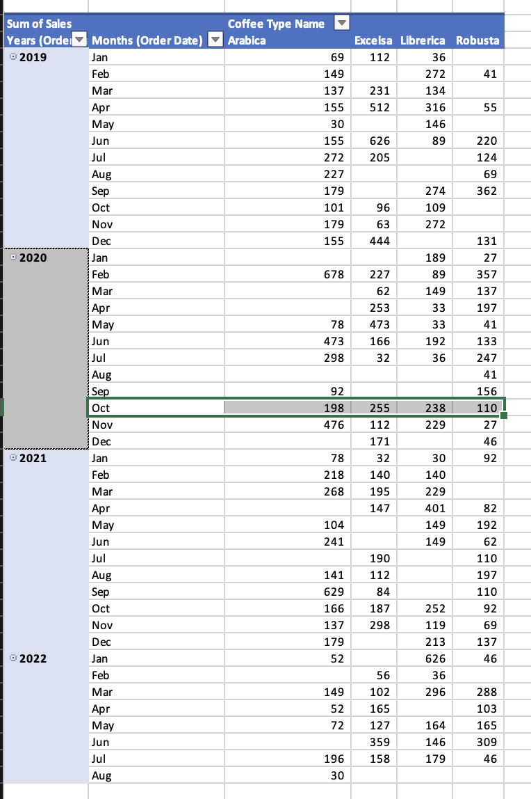
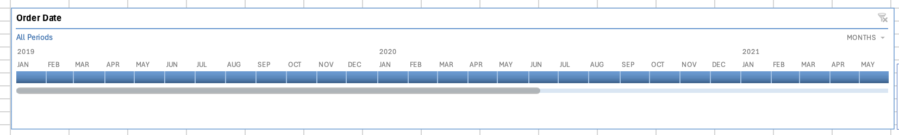
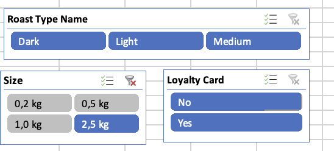

# ☕ Coffee Shop Sales Analytics

> **Excel-based dashboard for analyzing coffee sales and customer data**

---

## 🎯 Project Overview

This project involves creating a comprehensive sales dashboard in Excel for a coffee shop. The goal is to analyze sales data, understand customer behavior, and identify key trends to drive business growth. The dashboard will provide actionable insights through intuitive visualizations.

  

---

## 🚀 Project Progression

### Step 1: Data Gathering & Consolidation
We used `XLOOKUP` and `INDEX MATCH` to consolidate data.

- **Gather Customer Data:**
  - **Customer Name:** `=XLOOKUP(C2;customers!$A$1:$A$1001;customers!$B$1:$B$1001;;0)`
  - **Email (handling blanks):** `=IF(XLOOKUP(C2;customers!$A$1:$A$1001;customers!$C$1:$C$1001;;0) = 0;""; XLOOKUP(C2;customers!$A$1:$A$1001;customers!$C$1:$C$1001;;0))`
- **Gather Product Data:**
  - Used `INDEX MATCH` to retrieve product details like Coffee Type, Roast Type, and Size: `=INDEX(products!$A$1:$G$49;MATCH(orders!$D2;products!$A$1:$A$49;0);MATCH(orders!I$1;products!$A$1:$G$1;0))`

### Step 2: Data Cleaning & Transformation
We expanded abbreviations and added descriptive names for clarity.

- **Create Full Coffee Type Names:**
  - `=IF(I2="Rob";"Robusta"; IF(I2="Exc";"Excelsa"; IF(I2="Ara";"Arabica"; IF(I2="Lib";"Librerica";""))))`
- **Create Full Roast Type Names:**
  - `=IF(J2="M";"Medium"; IF(J2="L"; "Light"; IF(J2="D";"Dark";"")))`

### Step 3: Formatting
We applied consistent formatting for better readability.

- **Order Date:** `dd-mmm-yyyy`
- **Size:** `0,0 kg`
- **Unit Price & Sales:** Currency (`€`)

### Step 4: Finalizing the Table
We removed duplicates and converted the data range into an official Excel Table (`CMD + T`) to enable structured referencing and dynamic analysis.

### Step 5: Creating a Pivot Table for Total Sales
We created a Pivot Table to analyze sales over time.

- **Layout:** Set to "Tabular Form" for clear visualization.
- **Totals:** Turned off Grand Totals and Subtotals to focus on the data.

  

### Step 6: Designing the Sales Chart
We enhanced the chart for better insights and interactivity.

- **Design:** Changed line colors for better visibility.
- **Elements:** Added a Chart Title and a Primary Vertical Axis Title.
- **Filtering:** Inserted a Timeline for intuitive date range filtering.

  
  

### Step 7: Adding Slicers for Advanced Filtering
We inserted slicers to provide granular filtering options.

- **Slicers Added:** `Roast Type Name` & `Size`.
- **Loyalty Card Slicer:**
  - First, we added a "Loyalty Card" column to our main data table using `XLOOKUP`: `=XLOOKUP([@[Customer ID]];customers!$A$1:$A$1001;customers!$I$1:$I$1001;;0)`
  - Then, we inserted a slicer based on this new column.
- **Formatting:** Applied custom styling to the slicers to match the dashboard's design.

  

---

## 🗂️ Data Model

The data is structured into three main tables:

### 📦 Orders Table
| Field       | Description                          |
|-------------|--------------------------------------|
| Order ID    | Unique identifier for each order     |
| Order Date  | Date the order was placed            |
| Customer ID | Foreign key linking to Customer table|
| Product ID  | Foreign key linking to Product table |
| Quantity    | Number of units sold in the order    |

### 🧑‍🤝‍🧑 Customers Table
| Field          | Description                          |
|----------------|--------------------------------------|
| Customer ID    | Unique identifier for each customer  |
| Customer Name  | Name of the customer                 |
| Email          | Customer's email address             |
| Phone Number   | Customer's phone number              |
| Address Line 1 | Customer's street address            |
| City           | City of residence                    |
| Country        | Country of residence                 |
| Postcode       | Postal code                          |
| Loyalty Card   | Whether the customer has a loyalty card |

### ☕ Products Table
| Field          | Description                          |
|----------------|--------------------------------------|
| Product ID     | Unique identifier for each product   |
| Coffee Type    | Type of coffee (e.g., Arabica, Robusta) |
| Roast Type     | Roast level (e.g., Light, Medium, Dark) |
| Size           | Size of the product (e.g., 250g, 1kg) |
| Unit Price     | Price per unit                       |
| Price per 100g | Price normalized to 100g             |
| Profit         | Profit margin for the product        |

---

## 📬 Contact

**Ivan Zamurenko**  

---

  <i>Built with 📊 data-driven insights and ☕ attention to detail</i>

  © 2025 Ivan Zamurenko | Coffee Shop Sales Analytics Project

